### **Homework Management Framework**
The Homework Management framework automates the testing of key functionalities related to managing and tracking homework assignments,
ensuring that the system operates smoothly and accurately.

### **Automated Homework Management Testing Framework**

- This is a repository for a homework management automation framework.
- The framework is developed using Selenium for web automation and TestNG for test execution and reporting.
- It integrates reading and writing Excel files for data-driven testing.
- Reporting is managed through Cucumber Reports for clear and detailed output.

### **Key Features of This Framework:**

1. Generates detailed Cucumber reports for each test case, including step-by-step execution details.
2. Supports data-driven testing, allowing homework data to be read from Excel files.
3. Automates the creation, submission, and management of homework roles, permissions, and registrations.
4. Verifies that homework roles and permissions are updated correctly after approval or rejection.
5. Test execution can be triggered from the command line for easy integration into CI/CD pipelines.
6. Allows for the automation of positive and negative test scenarios.
### **Technologies/Tools Used in Building the Framework:**

- Selenium WebDriver
- TestNG
- Java
- Cucumber Reports
- Maven
- GitHub
- Jenkins
- IntelliJ

## Installation Instructions (Laptop)

### Prerequisites

Ensure you have the following installed on your laptop:

- Apache Maven(3.9.5)
- Java 17
- IntelliJ IDEA
    - **Plugins**: Cucumber For Java, Lombok, Jenkins
      (inside IntelliJ setting> plugins as below screenshot )

<div style="background-color: black; padding: 10px; text-align: center;">
  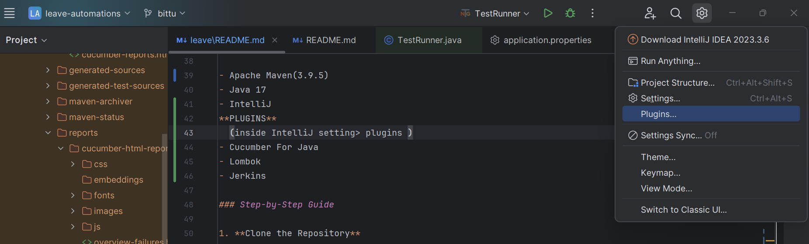
</div>

Download these plugins as shown below screenshot
<div style="background-color: black; padding: 10px; text-align: center;">
  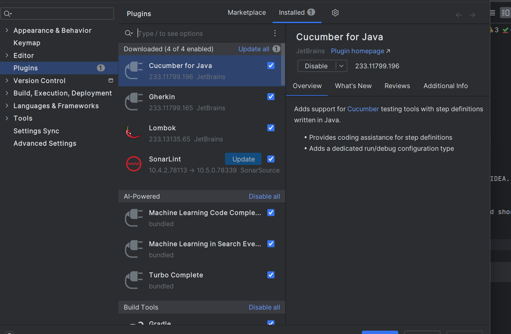
</div>

### Step-by-Step Guide

1. **Clone the Repository**

   Open a terminal and clone the repository:

   ```bash
   git clone https://github.com/zapizook-qa/homework-automations
   cd homework-automation

### **Import and run project in IDE:**

### 1. Open Your IDE

a.Launch your IDE(IntelliJ IDEA) and open the project i.e homework automation.

b. Go to **File menu** and select "Open" or "Open Project". Alternatively, you can use the keyboard shortcut Ctrl + O

<div style="background-color: black; padding: 10px; text-align: center;">
  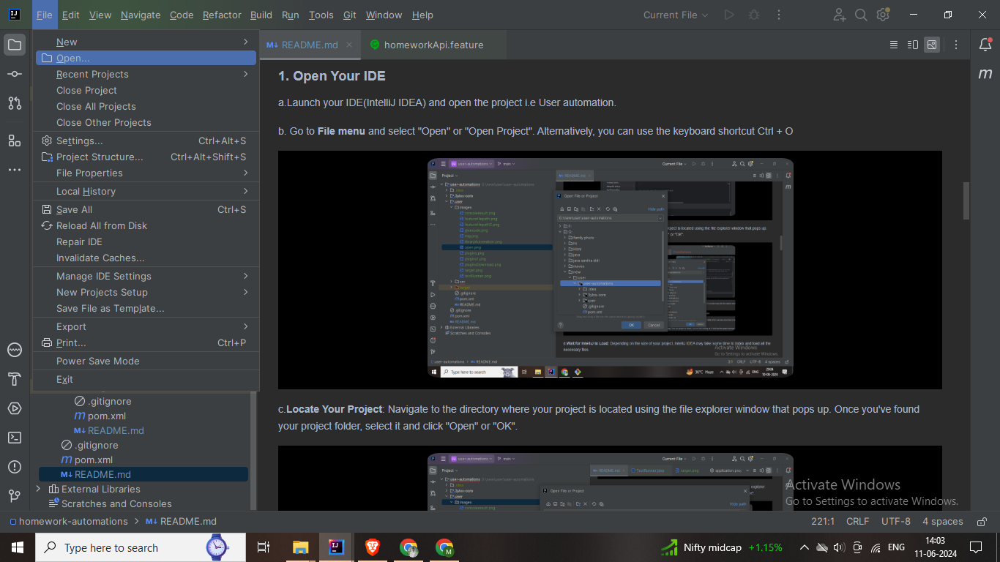
</div>

c.**Locate Your Project**: Navigate to the directory where your project is located using the file explorer window that
pops
up. Once you've found your project folder, select it and click "Open" or "OK".

<div style="background-color: black; padding: 10px; text-align: center;">
  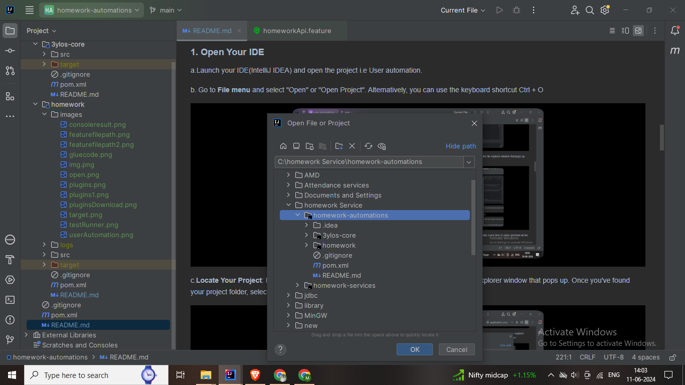
</div>

d.**Wait for IntelliJ to Load**: Depending on the size of your project, IntelliJ IDEA may take some time to index and
load all the necessary files.

e.**Start Working**: Once your project is loaded, you can start working on it. You'll see the project structure on the
left-hand side of the screen, where you can navigate through files and directories.

<div style="background-color: black; padding: 10px; text-align: center;">
  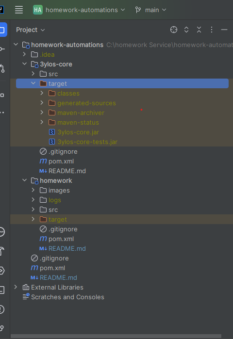
</div>

### 2. **Ensure Library Service Configuration**

Ensure your homework service is also running on some environment and also need to configure homework service url with homework
automation
[application.properties](homework/src/main/resources/application.properties)
add configuration in application.properties as a key API_BASE_URL and value is:homework service url

```

API_BASE_URL=http://localhost:8084/homework

```

### 3. **Run the Maven Command**

Before running the tests, you may need to clean and build the project to ensure all dependencies are installed.
Navigate to the root of your project and run the following command:

```

mvn clean install

```

<div style="background-color: black; padding: 10px; text-align: center;">
  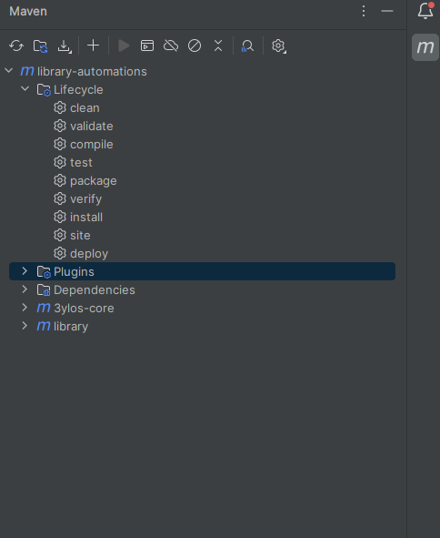
</div>

First double-click on "**clean**" and in console if u get build success then double-click on "**install**" as shown in
above screenshot

### 4. **Locate and Run the TestRunner Class**

Find the TestRunner class that is set up to run your Cucumber tests. Typically, this class is located in
[TestRunner.java](homework/src/test/java/com/threeylos/test/homework/TestRunner.java) a specific package dedicated to tests.

```
@CucumberOptions(features = "classpath:/features/api/homework/homeworkApi.feature",
        glue = "com.threeylos.test.homework.api.homework",
        tags = "@api"
)

```

```
features = classpath:/features/api/homework/homeworkApi.feature"

```

Key **features** and **glue** will be changed according to which test case you want to run. Value must be changed
accordingly.
Here is a screenshot where you can find the value of features. Find the feature file you want to run (e.g.,
lockingPeriod.feature), right-click, then find copy path/reference in the popup and click on path from source root.

<div style="background-color: black; padding: 10px; text-align: center;">
  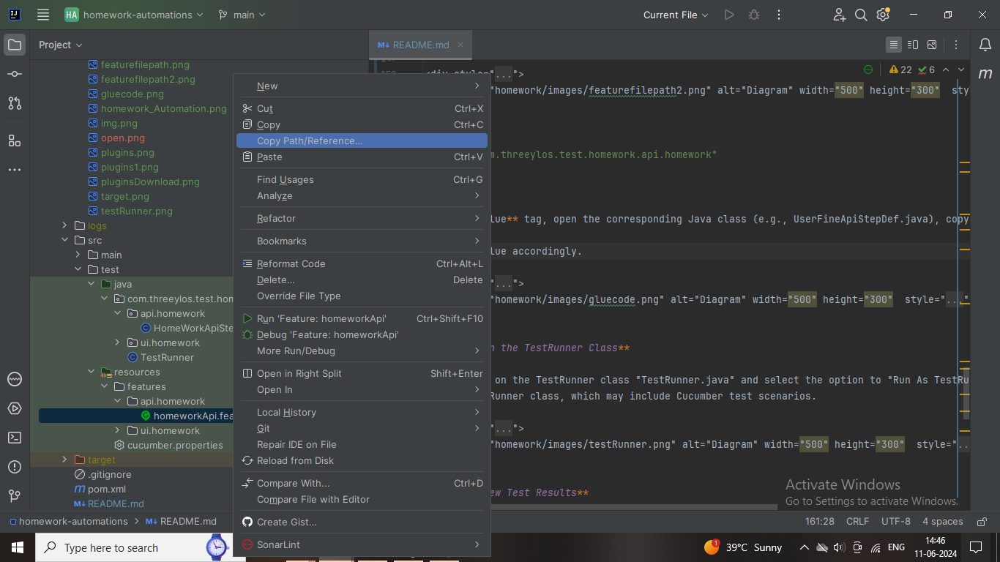
</div>

<div style="background-color: black; padding: 10px; text-align: center;">
  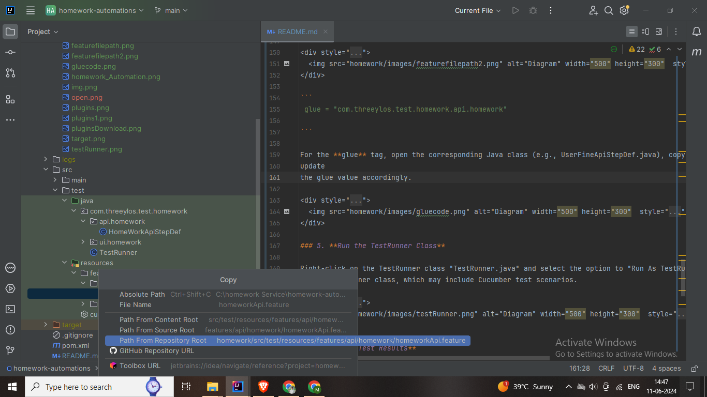
</div>

```
 glue = "com.threeylos.test.homework.api.homework"

```

For the **glue** tag, open the corresponding Java class (e.g., HomeWorkApiStepDef.java), copy the package name, and
update
the glue value accordingly.

<div style="background-color: black; padding: 10px; text-align: center;">
  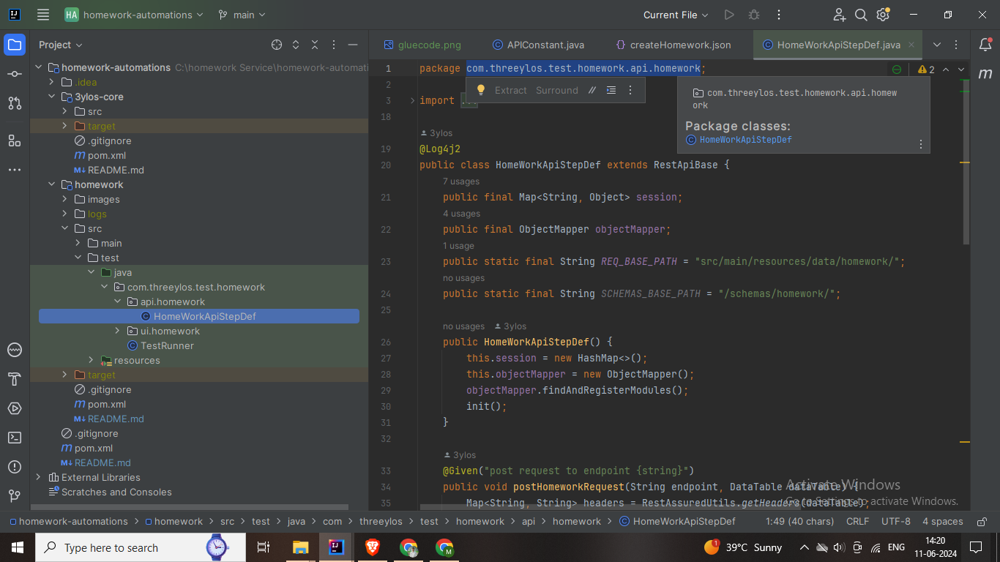
</div>

### 5. **Run the TestRunner Class**

Right-click on the TestRunner class "TestRunner.java" and select the option to "Run As TestRunner". This will execute the tests defined
in the TestRunner class, which may include Cucumber test scenarios.

<div style="background-color: black; padding: 10px; text-align: center;">
  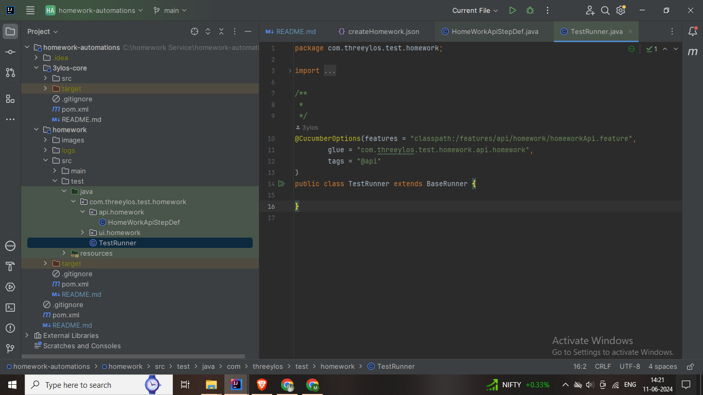
</div>

### 6. **View Test Results**

After running the tests, you can view the results in the test **output window(console)** of your IDE. This will show
which tests
passed or failed, along with any error messages or stack traces.

<div style="background-color: black; padding: 10px; text-align: center;">
  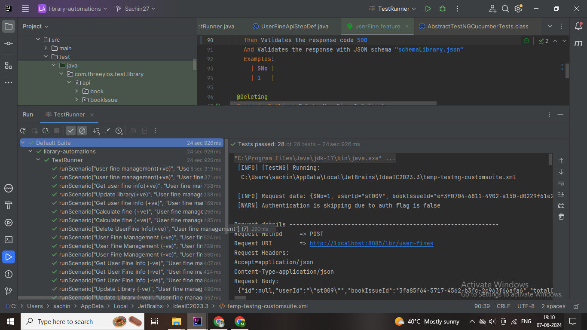
</div>

### 7. **Test Reports and Logs**

After running the tests, you can find the generated reports and logs in the following locations:

- **Cucumber Report**: If you're using Cucumber for behavior-driven development (BDD), look for the report in HTML
  format, typically found in [cucumber-reports.html](homework/target/cucumber/cucumber-reports.html)

- **Log Files**: For additional information about test execution, check the log files in `target/test-output`.

### Troubleshooting

If tests fail or encounter errors, check the following:

- **Test Runner Configuration**: Ensure your TestRunner class has the correct Cucumber options and includes the
  necessary feature files, glue code, and tags.
- **Logs and Error Messages**: Review logs in the `target/test-output` directory or your IDE's test output window(
  console) for error messages.
- **Database Connection**: If your tests interact with a MySQL database, ensure it is running and that the connection
  details in your environment variables are correct.

For more in-depth troubleshooting, check the documentation for the tools and frameworks you use, such as Cucumber,
TestNG, or Maven.

### Additional Resources

For more information on the frameworks and tools used in this project, refer to the following resources:

- [Cucumber](https://cucumber.io/)
- [TestNG](https://testng.org/)
- [Maven](https://maven.apache.org/guides/)


